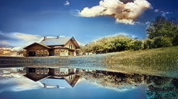

# Image Colorization

This project uses a pre-trained deep learning model to colorize black and white images. The model was trained using the **Caffe** framework and is designed to add color information to grayscale images based on patterns it has learned from a large dataset of color images.

## 📌 Project Overview

The **Image Colorization** project takes in a black-and-white (grayscale) image and uses a deep learning model to predict the missing color information, transforming the grayscale image into a colorized version. This process uses the **Caffe** framework and a pre-trained model that learns the mapping from grayscale images to their corresponding color information.


## 📁 Table of Contents

- [Installation](#installation)
- [Usage](#usage)
- [Evaluation Metrics](#evaluation-metrics)
- [Example](#example)

## 🛠️ Installation

### Clone the repository

To clone this repository, run the following command:

```bash
git clone https://github.com/your-username/image-colorization.git
cd image-colorization
```

### Download Pre-trained Model
You will need the following files inside a models/ folder:

```bash
colorization_deploy_v2.prototxt

colorization_release_v2.caffemodel

pts_in_hull.npy
```
You can find these files in the original repository or from other official model sources.

### Install Dependencies
Make sure you have Python 3.x installed on your machine. Then, you can install the required dependencies using pip:

```bash
pip install -r requirements.txt
```

### Additional Setup for Caffe
You will also need to install Caffe to use the pre-trained model. Please follow the installation instructions from Caffe's official documentation.

Alternatively, if you prefer to avoid installing Caffe manually, you can use the Python bindings (via cv2.dnn), which are simpler for this particular task.

## ▶️ Usage
1. Place your grayscale image in the imgs/ folder (or update the INPUT_IMAGE path in the code).

2. Run the script to colorize the image:

```bash
python colorization.py
```
The colorized image will be saved in the imgs_out/ folder.

The script also evaluates the quality of the colorization using two metrics: PSNR (Peak Signal-to-Noise Ratio) and SSIM (Structural Similarity Index).

## 📊 Evaluation Metrics

The script uses the following metrics to evaluate image quality:

1. PSNR: Peak Signal-to-Noise Ratio

2. SSIM: Structural Similarity Index

These compare the predicted colorized image against the original ground truth (color) image, if available.

## 📷 Example

Given a b&w image like this:


The model returns an colored image:


